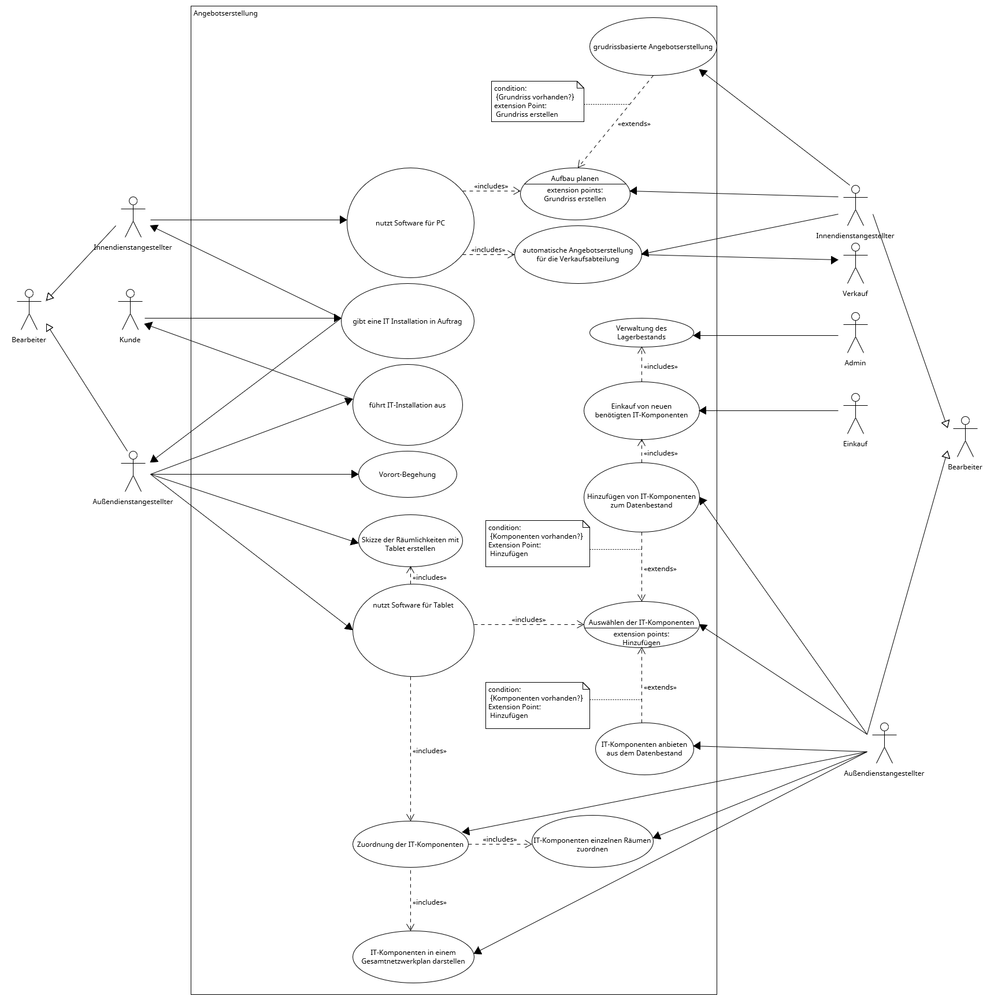

# Phase 1: Beschreibung der Geschäftsprozessszenarien des Kunden

## Aufgabenstellung

**Auftrag Ihres Chefs an Sie: Bereiten Sie die Erstellung eines Angebots für diese Softwareentwicklung vor!**

* Analysieren Sie die Vorgaben mit Augenmerk auf mögliche Beteiligte/Systeme (Personen/Objekte) des Geschäftsprozesses der ITSystemHausDD GmbH.
* Arbeiten Sie verschiedenen Zielplattformen für die Softwareentwicklung heraus und notieren Sie deren Vor-/Nachteile bzw. Besonderheiten.
* Ermitteln Sie Tätigkeiten und Beziehungen der beteiligten Objekte und Personen und stellen Sie diese grafisch dar. → Stichworte: Anwendungsfalldiagramm

## mögliche Beteiligte/Systeme

* Beteiligte:
    * Bearbeiter
    * Innendienstangestellter
    * Außendienstangestellter
    * Einkauf
    * Verkauf
    * Admin
    * Kunde
* Systeme:
    * Angebotserstellung

## Vor- und Nachteile der Zielplattform

 **Zielplattform: Java**

 * wurde von uns gewählt wegen der Plattformunabhängigkeit (Software muss auf dem PC und auf dem Tablet ausführbar sein)
 * man könnte auch eine andere Programmiersprache wählen und jeweils verschiedene Software für die verschiedenen Plattformen entwickeln, was jedoch mit einen unnötigen Mehraufwand verbunden ist (doppelte Entwicklung nötig, Kompatibilität der Software untereinander muss gewährleistet sein, getrennte Wartung und Updates nötig)

 Vorteile:

* ist einfach (weil strukturiert)
* unterstützt multi-threading
* ist sicher
* ist objektorientiert
* ist robust
* hat eine automatische Speicher- und Heap-Verwaltung
* kennt keine Pointers
* ist dynamisch, was das Runtime-System angeht (Klassen werden dann gelinkt, wenn sie benötigt werden)
* wurde entwickelt, Anwendungen in Netzwerken zu unterstützen (neue Module können über das Netzwerk implementiert werden)
* ist plattformunabhängig  (Java-Code ist ein Bytecode, kein Maschinencode und benötigt lediglich einen virtuellen Java-Processor, der den Bytecode interpretiert und ausführt)
    * Diese Java Virtual Machine ist in nur ca. 200 KB Code zu implementieren, d.h. Geräte, die diese 200 KB JVM integriert haben, können Java-Programme ausführen.
* stellt standardmäßig eine Bibliothek für einheitliche Grafikfunktionen von verschiedenen Windows-Systemen zur Verfügung, das Abstract Window Toolkit (AWT, java.awt)
* Applets sind einfach in WWW-Seiten einzubinden (können aus dem WWW geladen und ausgeführt werden)

Nachteile:

* **Der größte Vorteil ist auch gleichzeitig ein Nachteil: die Performance ist verringert, da Java-Code vom Interpreter (der die Plattformunabhängigkeit erst möglich macht) interpretiert wird. Momentan sind Java-Applikationen etwas langsamer als vergleichbare Anwendungen, die in C++ geschrieben wurden.**

## Anwendungsfalldiagramm
