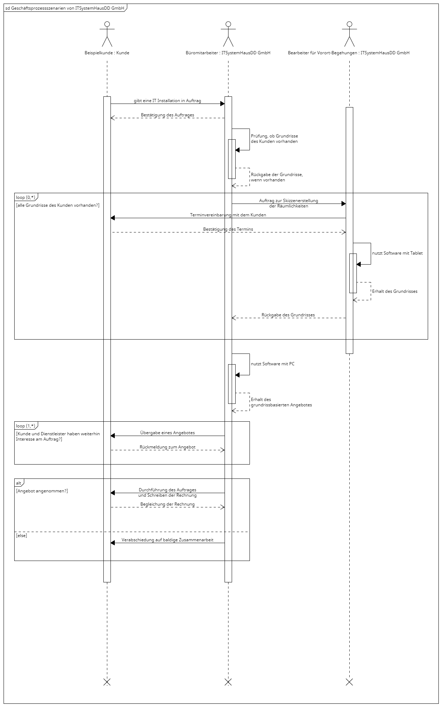

# Phase 3: Darstellung der zeitlichen Reihenfolge der Tätigkeiten

## Aufgabenstellung

**Sie stellen in einem Arbeitstreffen einem Kollegen das in Phase 1 erstellte Anwendungsfalldiagramm vor. Er findet die dargestellten Beziehungen der Beteiligten sehr gut. Er weist Sie aber darauf hin, dass sich ihm aus diesem Diagramm die genaue Reihenfolge der einzelnen Tätigkeiten nicht richtig erschließt.**

* Basis sind die gefundenen Beteiligten und die Tätigkeiten aus Phase 1.
* Stellen Sie die Reihenfolge der Tätigkeiten in einem sequentiellen Ablauf (sequentiell = nacheinander folgend) dar. → Stichworte: Sequenzdiagramm

## Sequenzdiagramm

