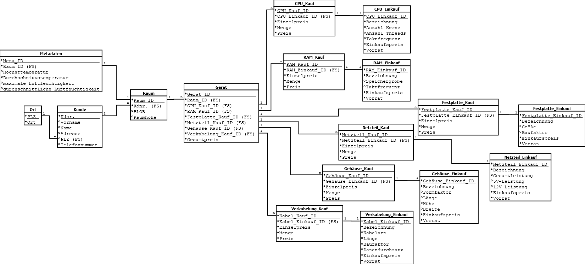

# Datenquellen in einen zentralen Datenbestand überführen

## Aufgabenstellung

**Bei einer Fortbildung für Fachinformatiker kommen Sie beim Mittagessen mit einem Teilnehmer ins Gespräch. Dieser erzählt Ihnen, dass es seinem Entwicklerteam unheimlich die Arbeit erleichtert, wenn die Anzahl der Datenquellen und Datenformate intern im Software-System gering gehalten wird.**

* Entwerfen Sie eine Datenmodell, welches den gesamten Datenbestand Ihres Software-Systems abbildet. Hinweis: binäre Daten sind als BLOB handhabbar.

## Entwurf eines Datenmodells, welches den gesamten Datenbestand des Software-Systems abbildet

* als relationales Datenbankmodell abgebildet mit [Dia als Open Source Programm](http://dia-installer.de/index.html.de)
* kann beliebig erweitert werden, bspw. mit weiteren Hardware-Komponenten und deren Eigenschaften

* alternativ: Download der [Dia-Datei](legal/relationales_Datenbankmodell_Datenmodell_Phase_8.dia) oder als [PNG](legal/images/relationales_Datenbankmodell_Datenmodell_Phase_8.png)