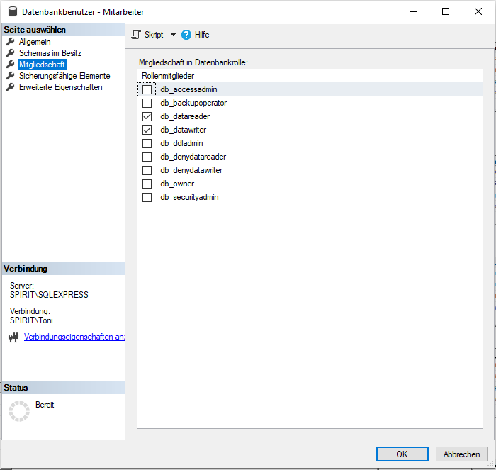
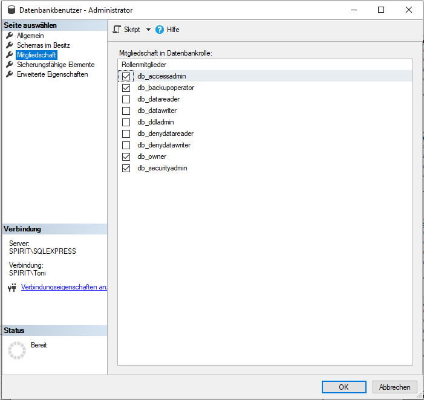

# Zentralen Datenbestand mit Nutzerverwaltung umsetzen

## Aufgabenstellung

* Implementieren Sie das Datenmodell mit einem geeigneten DBMS inklusive der Benutzerverwaltung und den eingeschränkten Lese- und Schreibrechten auf die Daten.

## Umsetzung in Microsoft SQL Server Management Studio (MSSMS)

* zur Umsetzung der Benutzerverwaltung und den eingeschränkten Lese- und Schreibrechten auf die Daten wurde das PDF-Dokument aus Phase 6 genutzt: [SQLServer - Kapitel 9](legal/pdfs/sql_server_2012_kapitel_9.pdf)
* die Tabellen wurde zur Reproduzierbarkeit mit einem [Skript](legal/Tabellen_erstellen.sql) erstellt (Systemtabellen werden nicht erstellt, da keine noch Software programmiert wurde)
* Anmeldung erfolgt über ein SQL Server-Konto (da eventuell die Software nicht von einen Windows-Betriebssystem darauf zugreift) mit dem Namen „Mitarbeiter” (für Einkauf, Verkauf, Außendienst und Innendienst, da diese für Datentabellen die gleichen Rechte besitzen) oder „Administrator”, dabei sind die Passwörter sind zu Testzwecken identisch mit den Anmeldenamen
* für die Datenbank „Software ITSystemHausDD GmbH” existieren die Benutzer „Mitarbeiter” und „Administrator”, denen die gleichnamigen Logins zugeordnet sind
* die  Benutzer besitzen folgende Rollen:

* hier eine Übersicht der Rollen:

* wenn die Systemtabellen durch die Software benötigt werden, empfiehlt es sich eigene Rollen zu definieren und den Benutzern zu zuweisen (am besten als Anmeldungskonto), da die vorgegebenen Rollen immer für alle Tabellen einer Datenbank gelten oder eventuell Serverrollen zu nutzen
* eine Sicherung der Datenbank kann [hier](legal/Software ITSystemHausDD GmbH.bak) runtergeladen werden